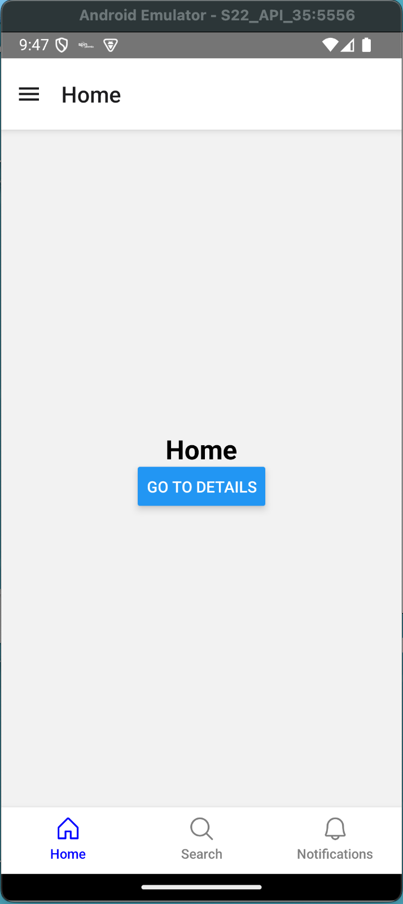
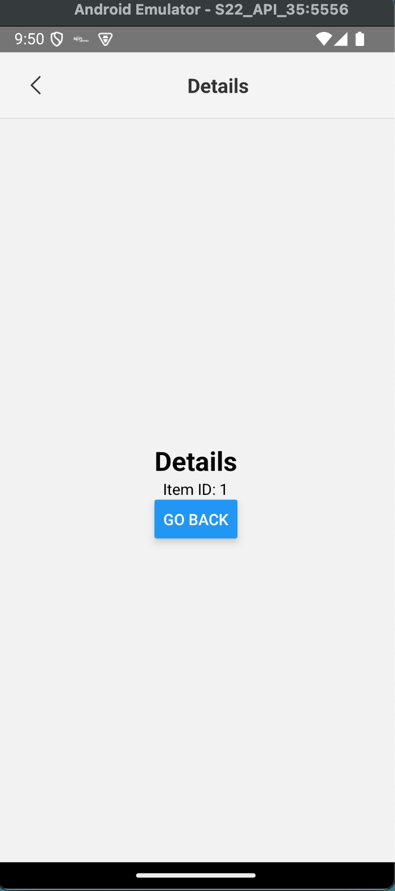
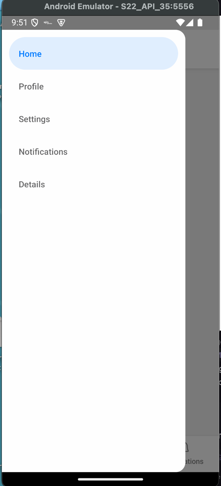

# 📱 Avanced navigation application

## 🛠️ Description

This repository contains the complete source code of our **React Native** application, designed to implement advanced navigation configurations and implementation of good development practices.

The application is fully functional and designed to provide a smooth and engaging user experience.

## 📂 Project Structure

```
📁 src
├── 📁 __tests__         # Unit tests
├── 📁 components    # Reusable components
├── 📁 screens       # Main application screens
├── 📁 navigators    # Navigation setup
├── 📁 context       # Global state management using Context API
├── 📁 types         # Types

📁 android           # Native code for Android
📁 ios               # Native code for iOS

```

---

## 🚀 Key Features

- **Intuitive Navigation**: Implemented with React Navigation.
- **Global State**: Uses Context API and AsyncStorage for persistence.
- **Cross-Platform Compatibility**: Supports both Android and iOS.
- **Multimedia Support**: Images and videos integrated into the interface.

---

## 🔧 Prerequisites

Ensure you have the following tools installed on your machine:

- [Node.js](https://nodejs.org/) (v14 or higher)
- [React Native CLI](https://reactnative.dev/docs/environment-setup)
- [Android Studio](https://developer.android.com/studio) or Xcode (for iOS)

---

## 📦 Installation

Follow these steps to clone and install the project:

1. Clone this repository:

   ```bash
   git clone https://github.com/luisortellado/AdvancedNavigationLabLuisOrtellado
   ```

2. Navigate to the project directory:

   ```bash
   cd AdvancedNavigationLabLuisOrtellado
   ```

3. Install dependencies:

   ```bash
   npm install
   ```

4. Run the application:
   - **Android**:
     ```bash
     npx react-native run-android
     ```
   - **iOS**:
     ```bash
     npx pod-install ios
     npx react-native run-ios
     ```

---

## 🧪 Testing

This project includes unit tests using **Jest** and **React Native Testing Library**. To run the tests:

```bash
yarn test
```

---

## 📸 Screenshots

### Home



### Details



### Drawer



---

## 🚨 Important Notes

- This project was tested on both Android and iOS devices.
- If you encounter any issues, check the logs with:
  ```bash
  npx react-native log-android
  npx react-native log-ios
  ```
- For any questions or suggestions, open an **issue** in this repository.

---

## 📝 License

This project is licensed under the MIT License. See the [LICENSE](LICENSE) file for more details.

---

## ✉️ Contact

- **Author**: Luis Carlos Ortellado Cabral
- **Email**: youremail@example.com
- **GitHub**: [github.com/your-username](https://github.com/your-username)
